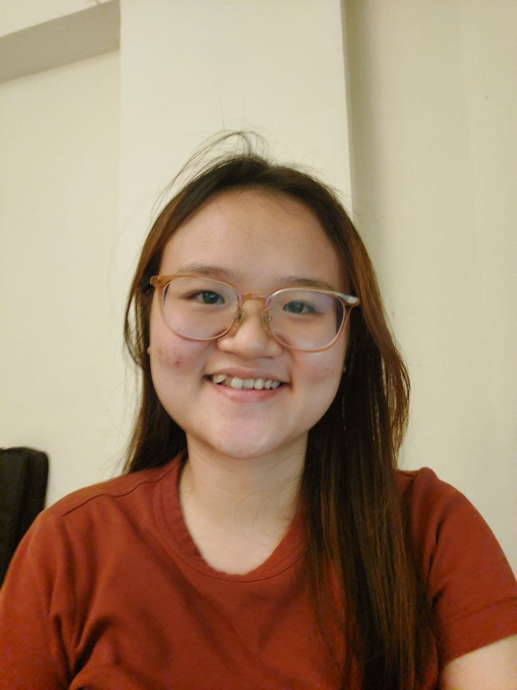
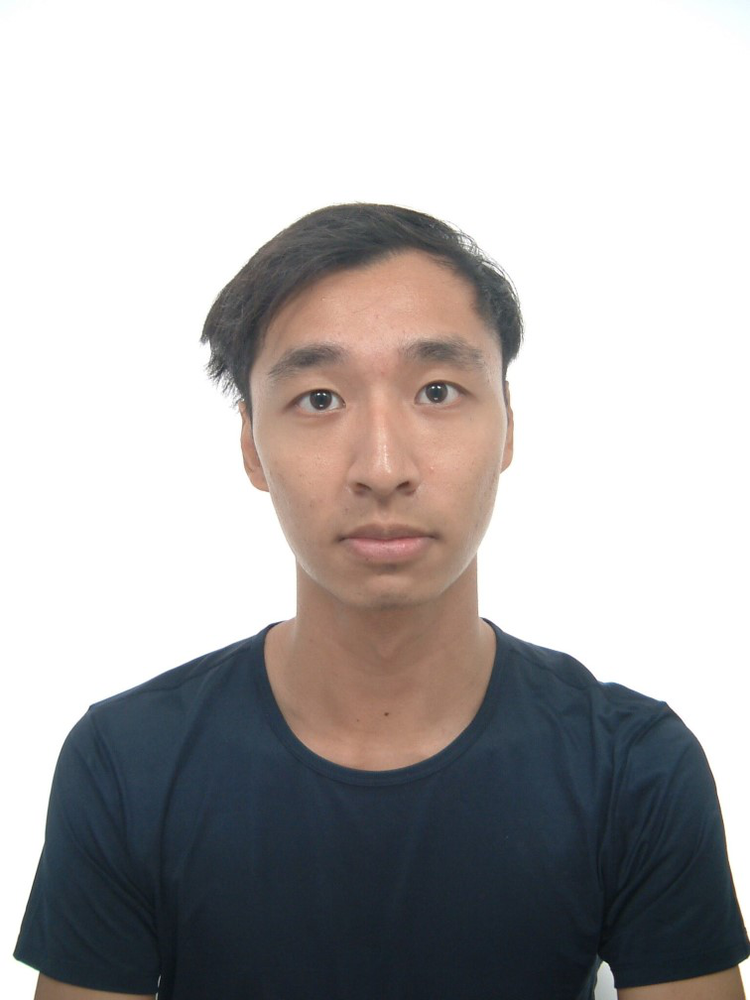
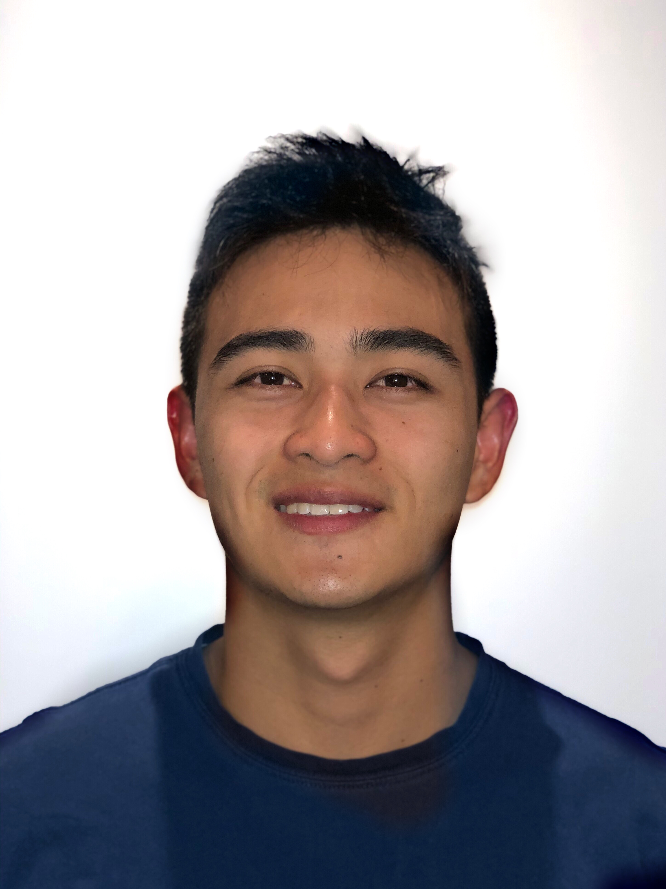

We are a team based in the [School of Computing, National University of Singapore](http://www.comp.nus.edu.sg).

You can reach us at the email `seer[at]comp.nus.edu.sg`

## Project team

### Nguyen Hong Anh

[[github](http://github.com/honganhcs)]
[[portfolio](team/honganhcs.md)]

* Role: Developer
* Responsibilities: Code Quality

### Johnny Doe

[[github](http://github.com/kev-intq)] [[portfolio](team/kev-intq.md)]

* Role: Developer
* Responsibilities: Front-end

### Lai Yuen Sheng

[[github](http://github.com/seanlaiys)]
[[portfolio](team/seanlaiys.md)]

* Role: Developer
* Responsibilities: Code Quality + Testing

### Yong Zi Xin

[[github](http://github.com/zixin448)]
[[portfolio](team/zixin448.md)]

* Role: Developer
* Responsibilities: Deliverables and deadlines

### Gareth Koh Sheng

[[github](http://github.com/garethkoh)]
[[portfolio](team/garethkoh.md)]

* Role: Developer
* Responsibilities: Documentation
