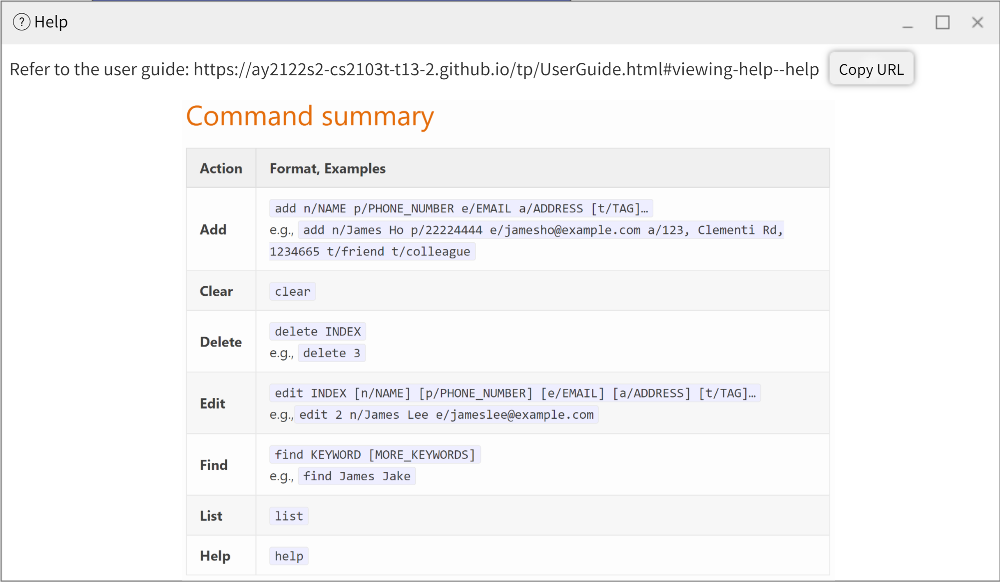

Greetings, TAs of NUS! camNUS is a **desktop app** for Teaching Assistants (TAs) to **manage their contacts.**

TAs can also add classes, assessments, and add their **existing contacts** as students. camNUS allows TAs to manage these components in one place.
For example,they can track attendance, class participation and assessment marks of their class.

camNUS is **optimized for use via a Command Line Interface** (CLI) while still having the benefits of a Graphical User Interface (GUI).
  As of now, camNUS is designed for use with **one module only** and thus all the tutorial classes in camNUS belongs to one module and **a student can only join one tutorial class**.

* Table of Contents
{:toc}

--------------------------------------------------------------------------------------------------------------------

## Quick start

1. Ensure you have Java `11` or above installed in your Computer.

2. Download the latest `camNUS.jar` from [here](https://github.com/AY2122S2-CS2103T-W13-2/tp/releases).

3. Copy the file to the folder you want to use as the _home folder_ for your camNUS app.

4. Double-click the file to start the app. The GUI similar to the below should appear in a few seconds. Note how the app contains some sample data. 
   

5. Type the command in the command box and press Enter to execute it. e.g. typing **`help`** and pressing Enter will open the help window. 
   Some example commands you can try:

   * **`list`** : Lists all contacts.

   * **`add`**`n/John Doe p/98765432 e/johnd@example.com a/John street, block 123, #01-01` : Adds a contact named `John Doe` to camNUS.

   * **`delete`**`3` : Deletes the 3rd contact shown in the current list.

   * **`clear`** : Deletes all contacts.

   * **`exit`** : Exits the app.

6. Refer to the [Features](#features) below for details of each command.
7. Refer to the [Valid Prefixes](#valid prefixes) below for the available prefixes.

--------------------------------------------------------------------------------------------------------------------
## Valid Prefixes

Here is a full list of prefixes available for reference. Every prefix is tailor-made for each specific command. To 
prevent any errors which leads to failure in executing your commands, use these prefixes according to the format provided
and refrain from making your own prefix. For more information on the prefix to use for a specific command, you may find the
command by clicking on it in the table of contents above, or scroll down to the bottom to find the table that summarises all commands.

1. `n/` : Name
2. `p/` : Phone
3. `e/` : Email
4. `a/` : Address
5. `t/` : Tag
6. `id/` : Student ID
7. `tm/` : Time
8. `d/` : Day
9. `wk/` : Week
10. `v/` : Venue
11. `tn/` : Tutorial Name
12. `as/` : Assessment Name
13. `w/` : Assessment Weightage
14. `f/` : Assessment Full-mark
15. `s/` : Score
16. `msg/` : Message

--------------------------------------------------------------------------------------------------------------------

## Features 

**:information_source: Notes about the command format:** 

* Words in `UPPER_CASE` are the parameters to be supplied by the user. 
  e.g. in `add n/NAME`, `NAME` is a parameter which can be used as `add n/John Doe`.

* All parameters are **case-sensitive**.

* Items in square brackets are optional. 
  e.g `n/NAME [t/TAG]` can be used as `n/John Doe t/friend` or as `n/John Doe`.

* Items with `…`​ after them can be used multiple times including zero times. 
  e.g. `[t/TAG]…`​ can be used as ` ` (i.e. 0 times), `t/friend`, `t/friend t/family` etc.

* Parameters are to be used with valid prefixes specified in the command. For a full list of valid prefixes, click [here](#valid-prefixes).

* Parameters can be in any order. 
  e.g. if the command specifies `n/NAME p/PHONE_NUMBER`, `p/PHONE_NUMBER n/NAME` is also acceptable.

* If a parameter is expected only once in the command but you specified it multiple times, only the last occurrence of the parameter will be taken. 
  e.g. if you specify `p/12341234 p/56785678`, only `p/56785678` will be taken.

* Extraneous parameters for commands that do not take in parameters (such as `list`, `exit` and `clear`) will be ignored. 
  e.g. if the command specifies `list 123`, it will be interpreted as `list`.

* Tags do not add any functionality to camNUS and are present solely to allow the users to keep track of any additional information.

----------------------------------------------------------------------------
### Viewing help : `help`

Opens a window containing a list of help commands.

Format: `help [COMMAND_NAME]`
* `COMMAND_NAME` is optional
* Directs the user to the list segment referred to by `COMMAND_NAME`
* Directs the user to the start of the list if `COMMAND_NAME` is unspecified

Examples:
* `help`
* `help delete`
* `help add`

## Person
### Adding a person: `add`

Adds a person to camNUS.

Format: `add n/NAME p/PHONE_NUMBER e/EMAIL a/ADDRESS [t/TAG]…​`

:bulb: **Tip:**
A person can have any number of tags (including 0)

Examples:
* `add n/John Doe p/98765432 e/johnd@example.com a/John street, block 123, #01-01`
* `add n/Betsy Crowe t/friend e/betsycrowe@example.com a/Newgate Prison p/1234567 t/criminal`

### Deleting a person : `delete`

Deletes the specified person from camNUS.

Format: `delete INDEX`

* Deletes the person at the specified `INDEX`.
* The index refers to the index number shown in the displayed person list.
* The index **must be a positive integer** 1, 2, 3, …​

Examples:

* `list` followed by `delete 2` deletes the 2nd person in camNUS.
* `find Betsy` followed by `delete 1` deletes the 1st person in the results of the `find` command.

### Editing a person : `edit`

Edits an existing person in camNUS.

Format: `edit INDEX [n/NAME] [p/PHONE] [e/EMAIL] [a/ADDRESS] [t/TAG]…​`

* `list` should be called before calling `edit` as this is the list that the `edit` command refers to.
* Edits the person at the specified `INDEX`. The index refers to the index number shown in the displayed person list. The index **must be a positive integer** 1, 2, 3, …​
* At least one of the optional fields must be provided.
* Existing values will be updated to the input values.
* When editing tags, the existing tags of the person will be removed i.e adding of tags is not cumulative.
* You can remove all the person’s tags by typing `t/` without
  specifying any tags after it.

Examples:

* `edit 1 p/91234567 e/johndoe@example.com` Edits the phone number and email address of the 1st person to be `91234567` and `johndoe@example.com` respectively.
* `edit 2 n/Betsy Crower t/` Edits the name of the 2nd person to be `Betsy Crower` and clears all existing tags.

### Listing all persons : `list`

Shows a list of all persons in camNUS.

Format: `list`

## Class
### Adding a class: `add_class`

Adds a class to the module.

Format: `add_class tn/TUTORIAL_NAME v/VENUE d/DAY tm/TIME wk/WEEK`
* `DAY` should be spelt in full or 3-letter abbreviation
* `TIME` refers to the start time of the class
* `WEEK` refers to the number of weeks the class will be held for

Examples:
* `add_class tn/T04 v/LT13 d/Monday tm/13:00 wk/13`
* `add_class tn/G04 v/E-LEARNING d/Wed tm/10:00 wk/13`

### Deleting a class : `delete_class`

Removes a class from the module

Format:`delete_class INDEX` or `delete_class tn/TUTORIAL_NAME`

* `TUTORIAL_NAME` should not be given if `INDEX` is given.
* `INDEX` should not be given if `TUTORIAL_NAME` is given.
* Deletes the class at the specified `INDEX` or `TUTORIAL_NAME`.
* All `Student` contacts in the class will be removed and replaced with a `Person` contact.
* The index refers to the index number shown in the displayed list of classes.
* The index **must be a positive integer** 1, 2, 3, …​

Examples:

* `delete_class 1`
* `delete_class tn/G04`

### Listing all classes: `list_class`

Shows a list of all classes on the any input date.

Formats: `list_class [d/DAY]`

* `DAY` is optional and should be used only for listing classes on a specific day.
* `DAY` should be spelt in full or 3-letter abbreviation.

Examples:

* `list_class`
  
* `list_class d/Wed`
  

## Student
### Adding person as a student to a class: `add_student`

Replaces the currently existing `Person` contact with a `Student` contact and adds them to a given class.

Format: `add_student n/NAME id/STUDENT_ID tn/TUTORIAL_NAME`

:information_source: **Note:** 
You can only add an existing person in camNUS as a student to an existing class! 
   
You can add a person using [`add` command](#adding-a-person-add). 
Eg: `add n/John Doe p/98765432 e/johnd@example.com a/John street, block 123, #01-01` 
   
You can add a class using [`add_class` command](#adding-a-class-add_class). 
Eg: `add_class tn/T04 v/LT13 d/Monday tm/13:00 wk/13` 

* Update the person with the specified `NAME` and `STUDENT_ID` to a `Student` contact and add the student to the specified class.
* Each student can only be assigned to one tutorial class.
* `NAME` refers to the name of an existing person in camNUS.
* `STUDENT_ID` refers to the student's unique NUSNET ID.
* `TUTORIAL_NAME` refers to the name of an existing tutorial in camNUS.

Examples:
* `add_student n/Amy Tan id/e0123456 tn/T13`

### Removing a student  : `remove_student`

Removes a student from a given class, replaces the `Student` contact with a `Person` contact.

Format: `remove_student INDEX tn/TUTORIAL_NAME` or `remove_student id/STUDENT_ID tn/TUTORIAL_NAME`.

* `list_student` has to be called before `remove_student` as this is the list referred to by the `remove_student` command
* Removes the student with the specified `INDEX` or `STUDENT_ID` from the class with specified `TUTORIAL_NAME`.
* The `INDEX` refers to the index number shown in the displayed list of student in the class.
* `STUDENT_ID` refers to the student's unique NUSNET ID.
* After this command is called, tutorial name and student id of the student will be deleted.
* The index **must be a positive integer** 1, 2, 3, …​

Examples:

* `remove_student 1 tn/G04`
* `remove_student id/e0123456 tn/G04`

### Listing students of a class: `list_student`

Shows a list of all students of a specified class.

Format:`list_student`, `list_student INDEX` or `list_student tn/TUTORIAL_NAME`

* If no parameters are given, the list of contacts who are students will be displayed.
* `TUTORIAL_NAME` should not be given if `INDEX` is given.
* `INDEX` should not be given if `TUTORIAL_NAME` is given.
* `list_class` command should be called before `list_student INDEX` as `INDEX` is relative to this list.
* Shows list of all students belonging to the class at the specified `INDEX` or `TUTORIAL_NAME`.
* The index refers to the index number shown in the displayed person list.
* The index must be a positive integer 1, 2, 3, …​

Examples:

* `list_student tn/G04`
* `list_student 1`
  

### Adding a comment for a student: `comment`

Adds a comment as a quick note for a student, for post class admin. Not meant to be used for results or attendance. Comments are deleted whenever a new one is added.

Format: `comment id/STUDENT_ID msg/COMMENT`
* `STUDENT_ID` refers to the student's unique NUSNET ID.
* `COMMENT` is the message to be commented.

Examples:
* `comment id/e0123456 msg/Unable to attend the next tutorial.`

### Removing a comment for a student: `remove_comment`

Removes a comment for a student.

Format: `remove_comment id/STUDENT_ID`
* `STUDENT_ID` refers to the student's unique NUSNET ID.

Examples:
* `remove_comment id/e0123456`

### Viewing a comment for a student: `view_comment`

Views a comment for a student.

Format: `view_comment id/STUDENT_ID`
* `STUDENT_ID` refers to the student's unique NUSNET ID.

Examples:
* `view_comment id/e0123455` 
  

## Assessment
### Adding an assessment component: `add_assessment`

Adds an assessment component to the module.

Format: `add_assessment as/ASSESSMENT_NAME w/WEIGHTAGE f/FULL_MARKS`
* `WEIGHTAGE` is out of 100%.
* `FULL_MARKS` is the full marks of the assessment.
* `FULL_MARKS` should be an integer between 1 and 1000 inclusive.

Examples:
* `add_assessment as/Attendance w/5 f/1`
* `add_assessment as/Assignment 1 w/10 f/10`

### Deleting an assessment component: `delete_assessment`

Deletes an assessment component from the module, removing all information about the assessment from the students taking the module.

Format: `delete_assessment as/ASSESSMENT_NAME`

* Deletes the assessment with the specified `ASSESSMENT_NAME`.

Examples:

* `delete_assessment as/Attendance`
* `delete_assessment as/Assignment 1`

### Listing all assessment components : `list_assessment`

Shows a list of all assessment components added.

Format: `list_assessment`

### Assigning assessment score to a student: `grade`

Assigns a score to a student in a specified assessment component. Displays the list of scores of students in the same class as given student for the given assessment.

Format: `grade as/ASSESSMENT_NAME n/NAME s/SCORE`
- `ASSESSMENT_NAME` is the name of the assessment.
- `NAME` is the name of the student to be graded.
- `SCORE` must be a non-negative integer that is smaller or equal to the full mark of the assessment with `ASSESSMENT_NAME` as its name. Since the full mark is an integer within the range 1-1000, the score must be an integer within the range 0-1000.
- If a score already exists for student `NAME` in assessment `ASSESSMENT_NAME`, the score will be updated to `SCORE`

Example: `grade as/Test 1 n/Amy Tan s/5`

### Listing scores of students in a class: `list_score`

Shows a list of the scores of all students of a given class for a given assessment component.

Format: `list_score as/ASSESSMENT_NAME tn/TUTORIAL_NAME`
- Shows an error message to user if either an assessment with `ASSESSMENT_NAME` or a class with `TUTORIAL_NAME` does not exist in camNUS.

Examples:

* list_score as/Assignment 1 tn/T04
  

### Marking attendance for a student: `mark_attendance`

Marks attendance for a specified student or all students in a specified class for a specified week.

Format: `mark_attendance tn/TUTORIAL_NAME [id/STUDENT_ID] wk/WEEK`

* `STUDENT_ID` is optional.
* `STUDENT_ID` refers to the student's unique NUSNET ID.
* `TUTORIAL_NAME` refers to the name of the tutorial group the student is assigned to.

Examples:

* `mark_attendance tn/T04 id/e0123456 wk/1`
* `mark_attendance tn/T04 wk/1`

### Unmarking attendance for a student: `unmark_attendance`

Unmarks attendance for a specified student or all students in a specified class for a specified week.

Format: `unmark_attendance tn/TUTORIAL_NAME [id/STUDENT_ID] wk/WEEK`

* `STUDENT_ID` is optional.
* `STUDENT_ID` refers to the student's unique NUSNET ID.
* `TUTORIAL_NAME` refers to the name of the tutorial group the student is assigned to.

Examples:

* `unmark_attendance tn/T04 id/e0123456 wk/1`
* `unmark_attendance tn/T04 wk/1`

### Listing attendance of a class: `list_attendance`

Generates the attendance list of a specified class, or a specified student.

Format:
1. `list_attendance tn/TUTORIAL_NAME wk/WEEK`
    * `TUTORIAL_NAME` refers to the name of an existing tutorial group.
    * `WEEK` refers to the week number of the requested attendance list.
    * Shows attendance of all students belonging to the class with the specified `TUTORIAL_NAME`.
2. `list_attendance id/STUDENT_ID`
    * `STUDENT_ID` refers to the student's unique NUSNET ID.
    * Shows attendance of student with specified `STUDENT_ID`.

Examples:

* `list_attendance tn/T04 wk/2`
  
* `list_attendance id/e0124444`
  

### Locating persons: `find`

Finds persons whose names contain any of the given keywords.

Format: `find KEYWORD [MORE_KEYWORDS]`

* The search is case-insensitive. e.g `hans` will match `Hans`
* The order of the keywords does not matter. e.g. `Hans Bo` will match `Bo Hans`
* Only the name is searched.
* Only full words will be matched. e.g. `Han` will not match `Hans`
* Persons matching at least one keyword will be returned (i.e. `OR` search).
  e.g. `Hans Bo` will return `Hans Gruber`, `Bo Yang`

Examples:

* `find John` returns `john` and `John Doe`
* `find flash peter` returns `Flash Thompson`, `Peter Parker` 
  

Find persons whose details by prefix matches any of the given keywords by prefix.

Format: `find [n/NAME] [tn/TUTORIAL_NAME] [t/TAG] [id/STUDENT_ID] [p/PHONE] [a/ADDRESS] [e/EMAIL]`

* Partial words will be matched. e.g. `n/Han` will match `Hans`
* Accepted prefixes includes `n/`, `p/`, `e/`, `a/`, `id/` and `tn/`
* At least one prefix have to be used to activate partial keyword matching.
* If invalid prefix or no prefix input given, original find will be activated.
* The search is case-insensitive. e.g `n/hans` will match `Hans`
* Keyword matching will always start from the first alphabet or number of the attribute value.
  e.g. `n/han` will return `Hansel` and will not return `Krishan`
* Persons matching at least one keyword will be returned (i.e. `OR` search).
  e.g. `n/Hans Bo` will return `Hans Gruber`, `Bo Yang` and `Hansel`

Examples:

* `find n/Jo` returns `john` and `John Doe` and `joseph`
* `find n/Ale id/e0321` returns `Alex Yeoh`, `David Li`

### Clearing all entries : `clear`

Clears all entries from camNUS.

Format: `clear`

### Exiting the program : `exit`

Exits the program.

Format: `exit`

### Saving the data

camNUS data is saved in the hard disk automatically after any command that changes the data. There is no need to save manually.

### Editing the data file

camNUS data is saved as a JSON file `[JAR file location]/data/addressbook.json`. Advanced users are welcome to update data directly by editing that data file.

:exclamation: **Caution:**
If your changes to the data file makes its format invalid, camNUS will discard all data and start with an empty data file at the next run.

### Archiving data files `[coming in v2.0]`

_Details coming soon ..._

--------------------------------------------------------------------------------------------------------------------

## FAQ

**Q**: How do I transfer my data to another Computer? 
**A**: Install the app in the other computer and overwrite the empty data file it creates with the file that contains the data of your previous camNUS home folder.

--------------------------------------------------------------------------------------------------------------------

## Command summary

| Action                | Format, Examples                                                                                                                                                                     |
|-----------------------|--------------------------------------------------------------------------------------------------------------------------------------------------------------------------------------|
| **Add**               | `add n/NAME p/PHONE_NUMBER e/EMAIL a/ADDRESS [t/TAG]…​`   e.g., `add n/James Ho p/22224444 e/jamesho@example.com a/123, Clementi Rd, 1234665  t/friend t/colleague`               |
| **Add Class**         | `add_class tn/TUTORIAL_NAME v/VENUE d/DAY tm/TIME wk/WEEK`   e.g., `add_class c/T04 v/LT13 d/Monday t/13:00 wk/13`                                                                |
| **Add Student**       | `add_student n/NAME id/STUDENT_ID tn/TUTORIAL_NAME`   e.g., `add_student n/Amy Tan id/e0123456 tn/T13`                                                                            |
| **Add Assessment**    | `add_assessment as/ASSESSMENT_NAME w/WEIGHTAGE f/FULL MARK`   e.g., `add_assessment as/Attendance w/5 f/10`                                                                       |
| **Clear**             | `clear`                                                                                                                                                                              |
| **Delete**            | `delete INDEX`  e.g., `delete 3`                                                                                                                                                  |
| **Delete Class**      | `delete_class INDEX [tn/TUTORIAL_NAME]`   e.g., `delete_class 1 [tn/G04]`                                                                                                         |
| **Remove Student**    | `remove_student INDEX tn/TUTORIAL_NAME`   `remove_student INDEX tn/TUTORIAL_NAME`   e.g. `remove_student 1 tn/G04` / `remove_student id/e0123456 tn/G04`                       |
| **Delete Assessment** | `delete_assessment as/ASSESSMENT_NAME`   e.g., `delete_assessment as/Attendance`                                                                                                  |
| **Edit**              | `edit INDEX [n/NAME] [p/PHONE_NUMBER] [e/EMAIL] [a/ADDRESS] [id/STUDENT_ID] [t/TAG]…​`  e.g.,`edit 2 n/James Lee e/jameslee@example.com`                                          |
| **Find**              | `find KEYWORD [MORE_KEYWORDS]`  e.g., `find James Jake` `find [n/NAME] [id/STUDENT_ID] [a/ADDRESS] [e/EMAIL] [p/PHONE_NUMBER] [tn/TUTORIAL_NAME] [t/TAG]`  e.g. find n/ALIC |
| **List**              | `list`                                                                                                                                                                               |
| **List Assessment**   | `list_assessment`                                                                                                                                                                    |
| **List Attendance**   | `list_attendance tn/TUTORIAL_NAME wk/WEEK`   `list_attendance id/STUDENT_ID`   e.g., `list_attendance tn/T04 wk/1` /  `list_attendance id/e0123456`                            |
| **List Class**        | `list_class [d/DAY]`   e.g., `list_class d/Wed`                                                                                                                                   |
| **List Student**      | `list_student INDEX [tn/TUTORIAL_NAME]`   e.g., `list_student 1 [tn/G04] `                                                                                                        |
| **List Score**        | `list_score as/ASSESSMENT_NAME tn/TUTORIAL_NAME`   e.g., `list_score as/Assignment 1 tn/T04`                                                                                      |
| **Grade**             | `grade as/ASSESSMENT_NAME n/NAME s/SCORE`   e.g., `grade as/Test 1 n/Amy Tan s/5`                                                                                                 |
| **Mark Attendance**   | `mark_attendance tn/TUTORIAL_NAME [id/STUDENT_ID] wk/WEEK`   e.g., `mark_attendance tn/T04 id/e0123456 wk/1`                                                                      |
| **Unmark Attendance** | `unmark_attendance tn/TUTORIAL_NAME [id/STUDENT_ID] wk/WEEK`   e.g., `unmark_attendance tn/T04 id/e0123456 wk/1`                                                                  |
| **Comment**           | `comment id/STUDENT_ID msg/COMMENT`   e.g., `comment id/e0123456 msg/Participated actively`                                                                                       |
| **Remove Comment**    | `remove_comment id/STUDENT_ID`   e.g., `remove_comment id/e0123456`                                                                                                               |
| **View Comment**      | `view_comment id/STUDENT_ID`   e.g., `view_comment id/e0123456`                                                                                                                   |
| **Help**              | `help [n/COMMAND_NAME]`   e.g.,`help n/delete`                                                                                                                                    |
| **Exit**              | `exit`                                                                                                                                                                               |
