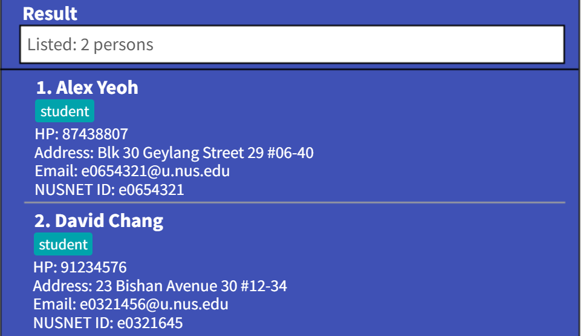

camNUS is a **desktop app** for Teaching Assistants (TAs) to **manage their own contacts, as well as assessments and class participation among students** in their contact book. It is **optimized for use via a Command Line Interface** (CLI) while still having the benefits of a Graphical User Interface (GUI).

* Table of Contents
{:toc}

--------------------------------------------------------------------------------------------------------------------

## Quick start

1. Ensure you have Java `11` or above installed in your Computer.

1. Download the latest `camNUS.jar` from [here](https://github.com/AY2122S2-CS2103T-W13-2/tp/releases).

1. Copy the file to the folder you want to use as the _home folder_ for your camNUS app.

1. Double-click the file to start the app. The GUI similar to the below should appear in a few seconds. Note how the app contains some sample data. 
   

1. Type the command in the command box and press Enter to execute it. e.g. typing **`help`** and pressing Enter will open the help window. 
   Some example commands you can try:

   * **`list`** : Lists all contacts.

   * **`add`**`n/John Doe p/98765432 e/johnd@example.com a/John street, block 123, #01-01` : Adds a contact named `John Doe` to the Address Book.

   * **`delete`**`3` : Deletes the 3rd contact shown in the current list.

   * **`clear`** : Deletes all contacts.

   * **`exit`** : Exits the app.

1. Refer to the [Features](#features) below for details of each command.

--------------------------------------------------------------------------------------------------------------------

## Features

**:information_source: Notes about the command format:** 

* Words in `UPPER_CASE` are the parameters to be supplied by the user. 
  e.g. in `add n/NAME`, `NAME` is a parameter which can be used as `add n/John Doe`.

* Items in square brackets are optional. 
  e.g `n/NAME [t/TAG]` can be used as `n/John Doe t/friend` or as `n/John Doe`.

* Items with `…`​ after them can be used multiple times including zero times. 
  e.g. `[t/TAG]…​` can be used as ` ` (i.e. 0 times), `t/friend`, `t/friend t/family` etc.

* Parameters can be in any order. 
  e.g. if the command specifies `n/NAME p/PHONE_NUMBER`, `p/PHONE_NUMBER n/NAME` is also acceptable.

* If a parameter is expected only once in the command but you specified it multiple times, only the last occurrence of the parameter will be taken. 
  e.g. if you specify `p/12341234 p/56785678`, only `p/56785678` will be taken.

* Extraneous parameters for commands that do not take in parameters (such as `help`, `list`, `exit` and `clear`) will be ignored. 
  e.g. if the command specifies `help 123`, it will be interpreted as `help`.

### Viewing help : `help`

Opens a window containing a list of help commands.

Format: `help [n/COMMAND_NAME]`
* `COMMAND_NAME` is optional
* Directs the user to the list segment referred to by `COMMAND_NAME`
* Directs the user to the start of the list if `COMMAND_NAME` is unspecified

Examples:
* `help`
* `help n/delete`
* `help n/add`

### Adding Commands

#### Adding a person: `add`

Adds a person to the address book.

Format: `add n/NAME p/PHONE_NUMBER e/EMAIL a/ADDRESS [t/TAG]…​`

:bulb: **Tip:**
A person can have any number of tags (including 0)

Examples:
* `add n/John Doe p/98765432 e/johnd@example.com a/John street, block 123, #01-01` 
* `add n/Betsy Crowe t/friend e/betsycrowe@example.com a/Newgate Prison p/1234567 t/criminal`

#### Adding a class: `add class`

Adds a class to the module.

Format: `add class c/CLASS_CODE v/VENUE d/DAY t/TIME`
* `DAY` should be spelt in full or 3-letter abbreviation
* `TIME` will be in 1 hour block

Examples:
* `add class c/T04 v/LT13 d/Monday t/1300`
* `add class c/G04 v/E-LEARNING d/Wed t/1000`

#### Adding student to a class: `add student`

Adds a specified student to a given class.

Format: `add student INDEX id/STUDENT_ID c/CLASS_CODE`

* Adds the person at the specified `INDEX` as a student belonging to a specified class.
* The index refers to the index number shown in the displayed person list.
* The index **must be a positive integer** 1, 2, 3, …​

Examples:
* `add student 1 id/e01234567 c/T13`

#### Adding an assessment component: `add assessment`

Adds an assessment component to the module.

Format: `add assessment a/ASSESSMENT_NAME w/WEIGHTAGE s/SCORE`
* `WEIGHTAGE` is out of 100%. 
* `SCORE` is the full marks of the assessment.

Examples:
* `add assessment a/Attendance w/5 s/1`
* `add assessment a/Assignment 1 w/10 s/10`

### Listing Commands

#### Listing all persons : `list`

Shows a list of all persons in the address book.

Format: `list`

#### Listing all classes: `list class`

Shows a list of all the classes on the any input date.

Formats:

* `list class`
* `list class [dt/DATE]`
* `list class [d/DAY]`
* `DAY`/`DATE` is optional 
* `DATE` input should be in `DD/MM/YYYY` format 
* `DAY` should be spelt in full or 3-letter abbreviation

Examples:

* `list class`

* `list class dt/20/02/2022`
* `list class d/Wed`

#### Listing students of a class: `list student`

Shows a list of all the students of a specified class.

Format:

* `list student INDEX`
* Shows list of student belonging to the class at the specified `INDEX`.
* The index refers to the index number shown in the displayed person list.
* The index must be a positive integer 1, 2, 3, …​

Examples:

* `list student 1`
  

### Editing a person : `edit`

Edits an existing person in the address book.

Format: `edit INDEX [n/NAME] [p/PHONE] [e/EMAIL] [a/ADDRESS] [id/STUDENT_ID] [t/TAG]…​`

* Edits the person at the specified `INDEX`. The index refers to the index number shown in the displayed person list. The index **must be a positive integer** 1, 2, 3, …​
* At least one of the optional fields must be provided.
* Existing values will be updated to the input values.
* When editing tags, the existing tags of the person will be removed i.e adding of tags is not cumulative.
* You can remove all the person’s tags by typing `t/` without
    specifying any tags after it.

Examples:

*  `edit 1 p/91234567 e/johndoe@example.com` Edits the phone number and email address of the 1st person to be `91234567` and `johndoe@example.com` respectively.
*  `edit 2 n/Betsy Crower t/` Edits the name of the 2nd person to be `Betsy Crower` and clears all existing tags.

### Locating persons by name: `find`

Finds persons whose names contain any of the given keywords.

Format: `find KEYWORD [MORE_KEYWORDS]`

* The search is case-insensitive. e.g `hans` will match `Hans`
* The order of the keywords does not matter. e.g. `Hans Bo` will match `Bo Hans`
* Only the name is searched.
* Only full words will be matched e.g. `Han` will not match `Hans`
* Persons matching at least one keyword will be returned (i.e. `OR` search).
  e.g. `Hans Bo` will return `Hans Gruber`, `Bo Yang`

Examples:

* `find John` returns `john` and `John Doe`
* `find alex david` returns `Alex Yeoh`, `David Li` 
  

### Deleting Commands

#### Deleting a person : `delete`

Deletes the specified person from the address book.

Format: `delete INDEX`

* Deletes the person at the specified `INDEX`.
* The index refers to the index number shown in the displayed person list.
* The index **must be a positive integer** 1, 2, 3, …​

Examples:

* `list` followed by `delete 2` deletes the 2nd person in the address book.
* `find Betsy` followed by `delete 1` deletes the 1st person in the results of the `find` command.

#### Deleting a class : `delete class`

Removes a class from the module

Format: `delete class INDEX`

* Deletes the class at the specified `INDEX`.
* The index refers to the index number shown in the displayed list of classes.
* The index **must be a positive integer** 1, 2, 3, …​

Examples:

* `delete class 1`

#### Removing a student  : `remove student`

Removes a student from a given class, but does not remove their contact from the address book.

Format: 
* `remove student i/INDEX c/CLASS_CODE`.
* `remove student id/STUDENT_ID c/CLASS_CODE`.
* Removes the student with the specified `INDEX` or `STUDENT_ID` from the class with specified `CLASS_CODE`.
* The `INDEX` refers to the index number shown in the displayed list of student in the class.
* The `STUDENT_ID` refers to the student_id of a particular student.
* The index **must be a positive integer** 1, 2, 3, …​

Examples:

* `remove student i/1 c/G04`
* `remove student id/e0123456 c/G04`

#### Deleting an assessment component: `delete assessment`

Deletes an assessment component from the module, removing all information about the assessment from the students taking the module.

Format: `delete assessment a/ASSESSMENT_NAME`

* Deletes the assessment with the specified `ASSESSMENT_NAME`.

Examples:

* `delete assessment a/Attendance`
* `delete assessment a/Assignment 1`

### Clearing all entries : `clear`

Clears all entries from the address book.

Format: `clear`

### Exiting the program : `exit`

Exits the program.

Format: `exit`

### Saving the data

AddressBook data are saved in the hard disk automatically after any command that changes the data. There is no need to save manually.

### Editing the data file

AddressBook data are saved as a JSON file `[JAR file location]/data/addressbook.json`. Advanced users are welcome to update data directly by editing that data file.

:exclamation: **Caution:**
If your changes to the data file makes its format invalid, AddressBook will discard all data and start with an empty data file at the next run.

### Archiving data files `[coming in v2.0]`

_Details coming soon ..._

--------------------------------------------------------------------------------------------------------------------

## FAQ

**Q**: How do I transfer my data to another Computer? 
**A**: Install the app in the other computer and overwrite the empty data file it creates with the file that contains the data of your previous camNUS home folder.

--------------------------------------------------------------------------------------------------------------------

## Command summary

| Action                | Format, Examples                                                                                                                                                       |
|-----------------------|------------------------------------------------------------------------------------------------------------------------------------------------------------------------|
| **Add**               | `add n/NAME p/PHONE_NUMBER e/EMAIL a/ADDRESS [t/TAG]…​`   e.g., `add n/James Ho p/22224444 e/jamesho@example.com a/123, Clementi Rd, 1234665  t/friend t/colleague` |
| **Add Class**         | `add class c/CLASS_CODE v/VENUE d/DAY t/TIME`   e.g., `add class c/T04 v/LT13 d/Monday t/1300`                                                                      |
| **Add Student**       | `add student INDEX id/STUDENT_ID c/CLASS_CODE`   e.g., `add student 1 id/e01234567 c/T13`                                                                           |
| **Add Assessment**    | `add assessment a/ASSESSMENT_NAME w/WEIGHTAGE s/SCORE`   e.g., `add assessment a/Attendance w/5 s/1`                                                                |
| **Clear**             | `clear`                                                                                                                                                                |
| **Delete**            | `delete INDEX`  e.g., `delete 3`                                                                                                                                    |
| **Delete Class**      | `delete class INDEX`   e.g., `delete class 1`                                                                                                                       |
| **Delete Student**    | `delete student INDEX`   e.g. `delete student 2`                                                                                                                    |
| **Delete Assessment** | `delete assessment a/ASSESSMENT_NAME`   e.g.,* `delete assessment a/Attendance`                                                                                     |
| **Edit**              | `edit INDEX [n/NAME] [p/PHONE_NUMBER] [e/EMAIL] [a/ADDRESS] [id/STUDENT_ID] [t/TAG]…​`  e.g.,`edit 2 n/James Lee e/jameslee@example.com`                            |
| **Find**              | `find KEYWORD [MORE_KEYWORDS]`  e.g., `find James Jake`                                                                                                             |
| **List**              | `list`                                                                                                                                                                 |
| **List Class**        | `list class [dt/DATE]`   e.g., `list class dt/20/02/2022`                                                                                                           |
| **List Student**      | `list student INDEX`   e.g., `list student 1`                                                                                                                       |
| **Help**              | `help [n/COMMAND_NAME]`   e.g.,`help n/delete`                                                                                                                      |
