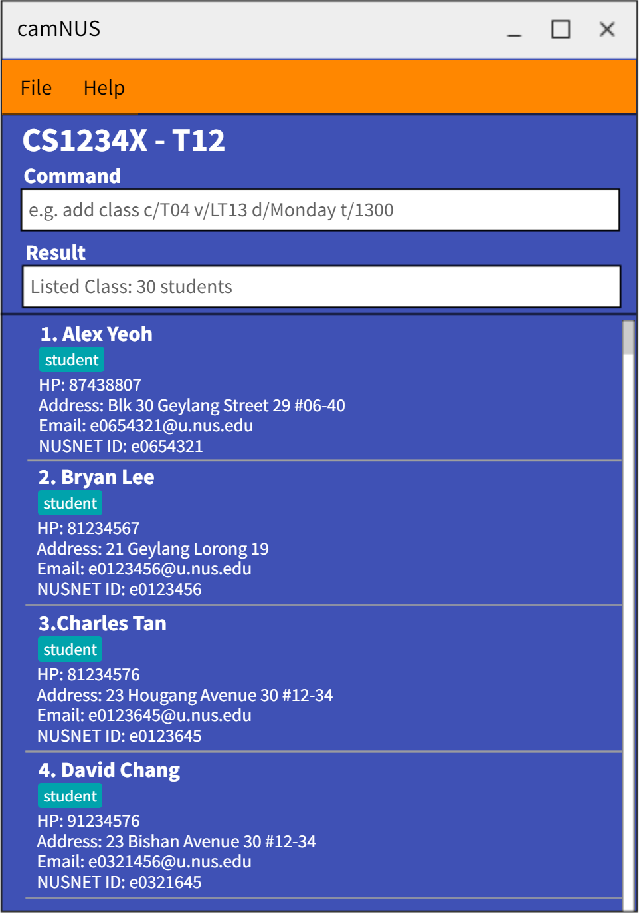

camNUS is a **desktop app** for Teaching Assistants (TAs) to **manage their own contacts, as well as assessments and class participation among students** in their contact book. While it has a GUI, most of the user interactions happen using a CLI (Command Line Interface).
* If you are interested in using camNUS, head over to the [_Quick Start_ section of the **User Guide**](UserGuide.html#quick-start).
* If you are interested about developing camNUS, the [**Developer Guide**](DeveloperGuide.html) is a good place to start.

**Acknowledgements**
* This project is based on the AddressBook-Level3 project created by the SE-EDU initiative.
* Libraries used: [JavaFX](https://openjfx.io/), [Jackson](https://github.com/FasterXML/jackson), [JUnit5](https://github.com/junit-team/junit5)
